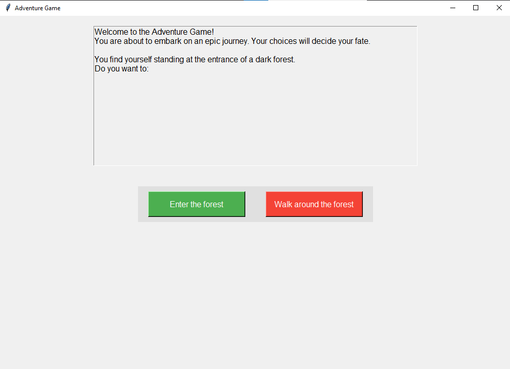

# Text_Game
A simple text game for some fun. 
 This is a simple text-based adventure game built using Python's Tkinter library for graphical user interfaces. The game allows players to make choices that affect the outcome of their journey through a dark forest, with various story paths and endings. 

<b>Features:</b> 
<b>Interactive Story:</b> Players choose from multiple options at each stage, shaping the outcome of their adventure. 
<b>Graphical Interface:</b> Uses Tkinter to display the game story and present interactive buttons for choices. 
<b>Multiple Endings:</b> Depending on the player's decisions, they can either win the game or face a tragic end. 
<b>Replayability:</b> After completing the game, players can click a "Play Again" button to start a new adventure. 
<b>Game Flow:</b> 
 The player begins at the entrance of a dark forest and is faced with different paths (e.g., entering the forest, walking around it). 
 As the player progresses, they encounter different scenarios like finding a wounded traveler or discovering a magical stone. 
 The game offers different choices at each point, leading to different storylines and outcomes. 
<b>Requirements:</b>
Python 3.x 
Tkinter library (usually comes pre-installed with Python) 
<b>How to Run:</b> 
Clone this repository to your local machine. 
Run the Python script using Python 3.x. 
Enjoy the adventure! 
Feel free to modify and expand the game, adding new scenarios and choices! 
 
